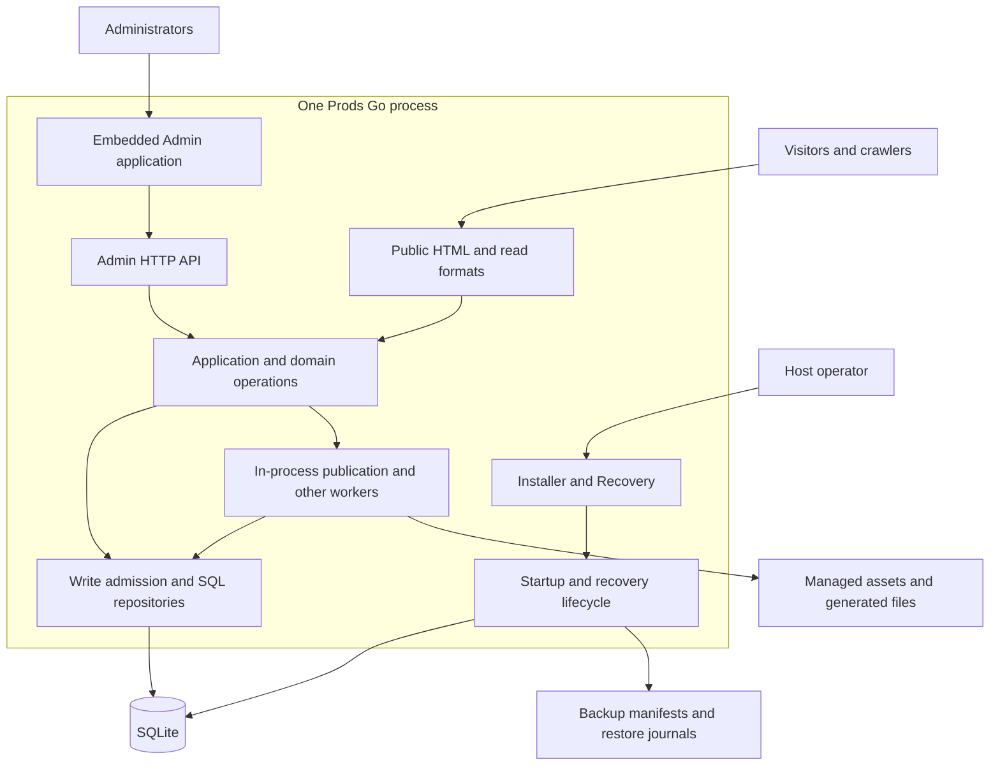

# Architecture overview

English | [繁體中文](../zh-TW/architecture.md) | [简体中文](../zh-CN/architecture.md)

[README](../../README.md) · [Engineering case study](engineering-case-study.md) · [Operations](operations.md)

This is a source-based description of the working tree reviewed on 2026-09-17, with `VERSION` set to `v0.6.8`. It describes implementation, not certification of a released artifact or a live deployment. English is the semantic source for these three-language engineering guides; they do not supersede product requirements or historical decisions.

## System context

Prods serves a company's technical catalog and request-for-quotation (RFQ) workflow. Administrators maintain product data, category-specific specifications, documents and website settings. Visitors discover published products and submit inquiries, including a Requested Part when the catalog has no match. RFQ intake records demand; it does not establish price, stock, electrical compatibility or a sales order.

The runtime is a modular monolith: one Go process, a SQLite database and managed filesystem roots. Workers run inside that process. A deployment may put a TLS reverse proxy in front; the repository does not establish that a particular production proxy is running.

The diagram groups responsibilities, not independently deployable services. Entry points and wiring are in [`cmd/prods/main.go`](../../cmd/prods/main.go) and [`internal/webapp/server.go`](../../internal/webapp/server.go).

## Components and reasons for their boundaries

| Boundary | Current implementation | Why it exists |
| --- | --- | --- |
| Domain and persistence | `internal/catalog`, `inquiries`, `site`, `localization`; SQL repositories in `internal/storage/sqlite` | Rules, durable state and transactions stay in Go rather than depending on a browser framework. |
| Public website | Go templates and generated product representations; dynamic search/listing/RFQ handlers | Core content and basic navigation remain available without JavaScript. |
| Public enhancements | React roots for RFQ selection and listing controls | Interactive selection enhances existing HTML without requiring whole-page hydration. |
| Admin | React, headless Refine Core, React Router, TanStack Query and native Ant Design v6 | Interactive management can use application state and forms without adding Admin dependencies to Public. |
| System UI | Separate Installer/Recovery entry points and embedded system assets | A damaged database or unavailable normal Admin must not make recovery depend on that same database/session. |
| Background work | Publication, import, backup, mail and search-notification managers in the process | Durable records track work; an in-memory wake-up is not proof of completion. |

See [`web/ui/package.json`](../../web/ui/package.json), the separate [`Vite configurations`](../../web/ui/vite.public.config.ts), [`Public roots`](../../web/ui/src/public/main.tsx), and [`system entry`](../../web/ui/src/system/main.tsx). Public HTML is generated by Go; this is not React server-side rendering. The Admin uses `@refinedev/core`, not `@refinedev/antd`.

## Request and data flows

Public operational routes include `GET /api/locales` and `POST /api/rfqs`, alongside HTML `GET/POST /rfq`. They are separate from generated read formats and authenticated `/admin/api/` operations. These routes are not a promise of a versioned external write-token API.

**Catalog edit and publication.** An Admin request carries a session, CSRF token and expected revision. The repository checks the write and records state, required audit and publication intent in a transaction. The publication engine stages representations and activates the product's public unit. A saved edit and an activated public revision are distinct events. The previous valid unit can remain available while a replacement is prepared. Hide/Archive updates visibility so new admissions cannot use the revoked product; an already admitted transfer may finish. Public admission happens before conditional response and Range handling. Shared assets remain available through other valid references.

Website-wide configuration and route changes have a separate site-epoch activation boundary. Search and other aggregate views may converge after product activation, subject to visibility checks. Generated-history directories are not exposed as a generic filesystem service. Evidence: [`catalog_store.go`](../../internal/storage/sqlite/catalog_store.go), [`publication_store.go`](../../internal/storage/sqlite/publication_store.go), [`protocol.go`](../../internal/publishing/protocol.go), [`publication tests`](../../internal/webapp/publication_test.go).

**Public discovery.** Public responses use [`PublicView`](../../internal/publishing/view.go), an explicit published-data model, rather than serializing Admin records. HTML, JSON-LD, JSON and Markdown share that model. Search folds Unicode using application code and escapes literal LIKE wildcards; identity comparison is separate. [`cataloglisting`](../../internal/cataloglisting/listing.go) computes applicable columns across the listing scope, not just the current page. Locale resolution records actual field provenance and skips disabled candidates. Closing multilingual editing only hides editing controls; published locale changes require Website publication. Evidence: [`product.go`](../../internal/catalog/product.go), [`resolver.go`](../../internal/localization/resolver.go), [`website localization tests`](../../internal/webapp/website_localization_test.go).

**RFQ submission.** The visitor explicitly submits a form. A high-entropy idempotency key identifies the attempt; a versioned canonical payload hash identifies its content. The RFQ, items and replayable receipt commit together. Repeating the same key and payload returns the saved receipt; a changed payload conflicts. A no-results search becomes a Requested Part only after a visitor chooses that action. SMTP sending is a separate authorized operation with recorded outcomes. Evidence: [`rfq.go`](../../internal/inquiries/rfq.go), [`SubmitRFQ`](../../internal/storage/sqlite/store.go), [`receipt lookup`](../../internal/storage/sqlite/rfq_receipt.go), [`mail manager`](../../internal/maildelivery/manager.go).

## Persistence model

| Data | Representation and constraint |
| --- | --- |
| Product identity | Stable opaque ID; Current/Archived record state and Published/Hidden visibility are separate. Manufacturer + Part Number conflicts are checked inside controlled writes, not a DB unique constraint. A blank manufacturer is distinct from a named one. |
| Technical specifications | Spec definitions, reusable Spec Sets, category assignments and per-product raw values; normalized values carry source/spec versions and status. Missing or unparseable values are not silently turned into zero. |
| Publication | Durable intents, active publication records, site epochs and generated immutable units. Generated output is derived, not the only copy of catalog truth. |
| Website and languages | Working/published settings, official Public Copy definitions/defaults and customer overrides; content source locale is independent of the Admin UI locale. |
| Operations | Sessions, jobs, RFQ receipts, audit, backup records and migration history in SQLite; restore evidence also lives in filesystem journals. |
| Files | Immutable assets referenced by stable IDs, private secrets/configuration, staged work and backups in managed roots. Files are durably placed before committed references. |

The base schema is in [`store.go`](../../internal/storage/sqlite/store.go); subsequent schema changes are in [`migrations.go`](../../internal/storage/sqlite/migrations.go). [`spec_document_store.go`](../../internal/storage/sqlite/spec_document_store.go), [`asset_store.go`](../../internal/storage/sqlite/asset_store.go) and [`D9 identity tests`](../../internal/storage/sqlite/d9_identity_test.go) show the data contracts.

`beginWrite` serializes admitted writes with a channel and context cancellation. This coordinates one process; it is not a distributed scheduler or a latency guarantee. Atomic Excel import validates ahead of its final all-or-nothing transaction, but that transaction can still delay RFQ writes. Product Bulk instead records separate per-product outcomes and permits partial success. See [`import_store.go`](../../internal/storage/sqlite/import_store.go) and [`product_bulk_store.go`](../../internal/storage/sqlite/product_bulk_store.go).

## Authentication and Admin APIs

Normal installations use a versioned password verifier and durable opaque server-side sessions. SQLite stores a session-token digest rather than the bearer value. Server-side capabilities authorize operations; hiding a button is not authorization. The shared Admin transport sends same-origin credentials and CSRF headers, rejects stale-session responses and reports an interrupted write as an unknown outcome. Automatic mutation retries and optimistic success are disabled.

The Refine DataProvider handles supported resource operations. Named adapters preserve Hide, Archive, Clone, URL change, preview and other domain workflows. A named command need not have a unique HTTP verb or endpoint: the current `publish` adapter uses a revisioned Product PUT. Generic delete is rejected in favor of Archive. Evidence: [`password.go`](../../internal/identity/password.go), [`session tests`](../../internal/storage/sqlite/installation_test.go), [`api.ts`](../../web/ui/src/admin/api.ts), [`dataProvider.ts`](../../web/ui/src/admin/dataProvider.ts), [`catalogCommands.ts`](../../web/ui/src/admin/catalogCommands.ts), [`AdminProviders.tsx`](../../web/ui/src/admin/AdminProviders.tsx).

## Runtime, installation and recovery

Defaults resolve from the executable directory. Configuration precedence is CLI → environment → one `prods.ini` → defaults. Node.js/pnpm build the embedded assets; they are not required on the application host. The SQLite driver is `modernc.org/sqlite`; release builds disable CGO. Optional Linux systemd and Windows service code exists. Release scripts also cross-compile macOS artifacts; compilation alone is not platform acceptance.

Startup classifies durable state before normal operation. Fresh data enters Installer; an incomplete installation resumes with a new claim. Installer commits the Owner, minimum settings, system categories, required log and Ready marker atomically, then requires restart. An unrecognized/damaged database enters Recovery Required, never a replacement installation. Migration requires backup evidence. Restore stages roots and writes a durable journal; after `prepared`, only the same operation rolls forward, checking each root before final verification. Maintenance controls admission while keeping repair paths available. See [operations](operations.md) for runtime evidence and limits.

## Constraints and evolution triggers

These are review criteria, not approved migrations or a roadmap:

- Revisit database/write scheduling if measured contention makes RFQ latency unacceptable during representative imports; there is no verified production traffic envelope here.
- Revisit process boundaries if profiling shows that worker resource limits cannot protect interactive work, or independent availability becomes a concrete requirement.
- Revisit search after measured catalog/query workloads outgrow the current projection; external search is not currently required.
- Revisit the Admin bridge if supported upgrades break pinned compatibility or adapters become harder to maintain than the framework saves.
- Revisit storage/deployment assumptions when native-platform or filesystem tests show locking, rename, sync or recovery behavior differs. No multi-node failover is implemented by the instance lock.

The implementation includes machine-readable catalog outputs, not an LLM, RAG service or electrical-replacement recommendation engine. V1 excludes commerce, CRM, arbitrary JavaScript/templates, a generic page builder and externally issued write tokens. The [case study](engineering-case-study.md) explains the trade-offs without turning these boundaries into claims about future scale.
