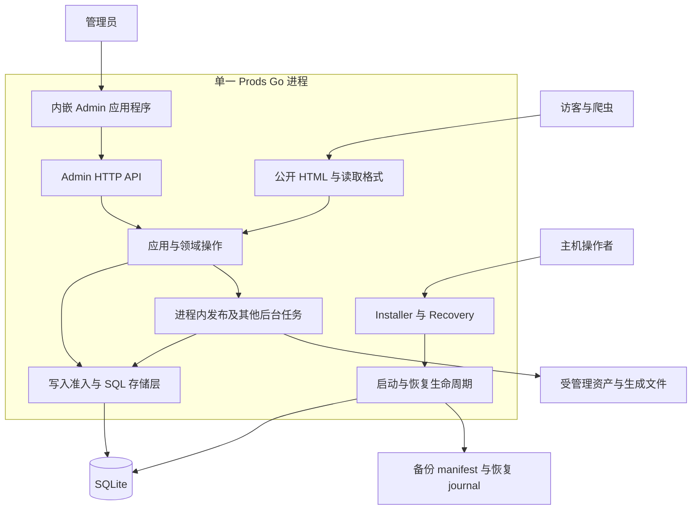

# 架构概览

[English](../en/architecture.md) | [繁體中文](../zh-TW/architecture.md) | 简体中文

[README](../../README-zh_CN.md) · [工程案例研究](engineering-case-study.md) · [运维](operations.md)

本文档根据 2026-09-17 查看的工作目录源代码撰写，当时 `VERSION` 为 `v0.6.8`。内容描述实现，不代表已验证某个发布成品或生产部署。这组三语工程指南以英文为语义基准，不取代产品需求或历史决策。

## 系统情境

Prods 提供企业技术产品目录与 RFQ（询价请求）流程。管理员维护产品数据、分类专属规格、文件及网站配置；访客探索已发布产品并提交询价，产品目录找不到时也可提出 Requested Part。RFQ 记录需求，不代表价格、库存、电气兼容性或销售订单。

运行环境采用模块化单体：一个 Go 进程、一份 SQLite 数据库及受管理的文件系统目录。后台任务在同一进程运行。部署时可在前方放置 TLS 反向代理；代码仓库并未证实任何特定正式代理正在运作。

图中分组代表责任，不是可独立部署的服务。入口与组装位于 [`cmd/prods/main.go`](../../cmd/prods/main.go) 及 [`internal/webapp/server.go`](../../internal/webapp/server.go)。

## 组件及边界理由

| 边界 | 目前实现 | 存在理由 |
| --- | --- | --- |
| 领域与持久化 | `internal/catalog`、`inquiries`、`site`、`localization`；SQL repository 位于 `internal/storage/sqlite` | 规则、持久状态与事务留在 Go，不依赖浏览器框架。 |
| 公开网站 | Go template、生成的产品表示，以及动态搜索／列表／RFQ handler | 核心内容与基本导航不需要 JavaScript。 |
| 公开交互增强 | RFQ 选取与列表控制的 React root | 在既有 HTML 上增加交互，不要求整页 hydration。 |
| Admin | React、headless Refine Core、React Router、TanStack Query、原生 Ant Design v6 | 管理界面可使用应用状态与表单，不把 Admin 依赖软件包带入 Public。 |
| System UI | 独立 Installer／Recovery 入口与内嵌 system assets | 数据库损坏或正常 Admin 无法使用时，恢复不能依赖同一数据库／session。 |
| 后台任务 | 进程内的发布、导入、备份、邮件与搜索通知管理器 | 以持久记录追踪工作；内存中的唤醒信号不代表完成。 |

参见 [`web/ui/package.json`](../../web/ui/package.json)、分离的 [`Vite 配置`](../../web/ui/vite.public.config.ts)、[`Public roots`](../../web/ui/src/public/main.tsx) 及 [`system 入口`](../../web/ui/src/system/main.tsx)。Public HTML 由 Go 生成，并非 React server-side rendering。Admin 使用 `@refinedev/core`，未使用 `@refinedev/antd`。

## 请求与数据流程

Public operational routes 包含 `GET /api/locales`、`POST /api/rfqs` 及 HTML `GET/POST /rfq`，与生成的读取格式、需要认证的 `/admin/api/` 操作分开。这些路由不代表承诺提供带版本的外部 write-token API。

**产品目录编辑与发布。** Admin 请求带入 session、CSRF token 与预期 revision。存储层检查写入，并在同一事务记录状态、必要审计及发布意图。发布引擎准备各种表示，再启用产品的公开单元。存储编辑与启用公开 revision 是不同事件；准备替代版本时，可继续提供前一个有效单元。Hide／Archive 更新可见性，使新的访问准入无法使用已撤销产品；已准入的传输可以完成。公开准入先于条件式响应及 Range 处理。共用资产仍可通过其他有效引用提供。

全站配置与路由变更有独立的 site epoch 启用边界。搜索等汇总查看可在产品启用后收敛，但必须检查可见性。历史生成目录不通过通用文件服务公开。证据：[`catalog_store.go`](../../internal/storage/sqlite/catalog_store.go)、[`publication_store.go`](../../internal/storage/sqlite/publication_store.go)、[`protocol.go`](../../internal/publishing/protocol.go)、[`发布测试`](../../internal/webapp/publication_test.go)。

**公开探索。** 公开响应使用明确的已发布数据模型 [`PublicView`](../../internal/publishing/view.go)，不直接序列化 Admin 记录。HTML、JSON-LD、JSON 与 Markdown 共用此模型。搜索由应用程序处理 Unicode folding，并转义作为字面值的 LIKE 万用字元；身份比对是另一套责任。[`cataloglisting`](../../internal/cataloglisting/listing.go) 依整个列表范围计算适用字段，不只看目前页面。语言解析记录各字段的实际来源，并跳过已停用的候选语言。关闭多语言编辑只隐藏编辑控制；公开语言变更必须经过 Website 发布。证据：[`product.go`](../../internal/catalog/product.go)、[`resolver.go`](../../internal/localization/resolver.go)、[`Website 多语测试`](../../internal/webapp/website_localization_test.go)。

**RFQ 提交。** 访客明确提交表单。高熵 idempotency key 识别这次提交，具版本的 canonical payload hash 识别内容。RFQ、项目与可重放回执一起提交事务。相同 key／内容返回既有回执；内容不同则冲突。搜索无结果只在访客主动选择后才转成 Requested Part。SMTP 寄送是另一个经授权且记录结果的操作。证据：[`rfq.go`](../../internal/inquiries/rfq.go)、[`SubmitRFQ`](../../internal/storage/sqlite/store.go)、[`回执查询`](../../internal/storage/sqlite/rfq_receipt.go)、[`邮件管理器`](../../internal/maildelivery/manager.go)。

## 持久化模型

| 数据 | 表示与约束 |
| --- | --- |
| 产品身份 | 稳定不透明 ID；Current／Archived 记录状态与 Published／Hidden 可见性分开。Manufacturer + Part Number 冲突在受控写入内检查，不靠 DB unique constraint。空白制造商与具名制造商不同。 |
| 技术规格 | Spec definition、可重用 Spec Set、分类指派及逐产品原始值；规范化值带有来源／规格版本与状态。缺值或无法解析的值不会默默变成零。 |
| 发布 | 持久意图、启用记录、site epoch 与不可变生成单元。生成输出是衍生数据，不是产品目录真实数据的唯一副本。 |
| Website 与语言 | 工作中／已发布配置、官方 Public Copy 定义／默认值及客户覆盖；内容来源语言与 Admin UI 语言无关。 |
| 运维 | SQLite 保存 session、工作、RFQ 回执、审计、备份记录与 migration history；文件系统 journal 另保存恢复证据。 |
| 文件 | 以稳定 ID 引用的不可变资产、私有 secrets／配置、暂存工作与备份分属受管理目录。文件先完成持久化放置，再提交引用。 |

基础 schema 位于 [`store.go`](../../internal/storage/sqlite/store.go)，后续变更位于 [`migrations.go`](../../internal/storage/sqlite/migrations.go)。[`spec_document_store.go`](../../internal/storage/sqlite/spec_document_store.go)、[`asset_store.go`](../../internal/storage/sqlite/asset_store.go) 与 [`D9 身份测试`](../../internal/storage/sqlite/d9_identity_test.go) 呈现数据契约。

`beginWrite` 使用 channel 与 context cancellation 序列化已准入写入。这是单进程协调，不是分散式调度器或延迟保证。Atomic Excel Import 在最终全成全败事务前先验证，但最终事务仍可能延迟 RFQ 写入。Product Bulk 则记录逐产品结果，允许部分成功。参见 [`import_store.go`](../../internal/storage/sqlite/import_store.go) 与 [`product_bulk_store.go`](../../internal/storage/sqlite/product_bulk_store.go)。

## 认证与 Admin API

正常安装使用具版本的密码验证器与持久、不透明的 server-side session。SQLite 存储 session token 的摘要，不存 bearer 原值。操作由服务器端 capability 授权；隐藏按钮不是授权。共用 Admin transport 传送 same-origin credentials 与 CSRF header，拒绝过期 session 的响应，并把中断写入标示为结果未知。不启用自动 mutation retry 或乐观成功。

Refine DataProvider 处理支持的 resource 操作；具名 adapter 保留 Hide、Archive、Clone、URL 变更、preview 等领域流程。具名命令不一定有独立 HTTP verb 或 endpoint：目前 `publish` adapter 使用带 revision 的 Product PUT。通用 delete 被拒绝，应使用 Archive。证据：[`password.go`](../../internal/identity/password.go)、[`session 测试`](../../internal/storage/sqlite/installation_test.go)、[`api.ts`](../../web/ui/src/admin/api.ts)、[`dataProvider.ts`](../../web/ui/src/admin/dataProvider.ts)、[`catalogCommands.ts`](../../web/ui/src/admin/catalogCommands.ts)、[`AdminProviders.tsx`](../../web/ui/src/admin/AdminProviders.tsx)。

## 运行环境、安装与恢复

默认路径以可执行文件目录为基准。配置优先序为 CLI → 环境变量 → 单一 `prods.ini` → 默认值。Node.js／pnpm 用于构建内嵌资产，不是应用主机的运行需求。SQLite driver 为 `modernc.org/sqlite`，发布构建停用 CGO。已有可选 Linux systemd 与 Windows service 代码；发布脚本也交叉编译 macOS 成品，但编译不等于平台验收。

启动先分类持久状态，再进入正常操作。全新数据进入 Installer；未完成安装以新 claim 继续。Installer 原子提交 Owner、最低站点配置、系统分类、必要 log 与 Ready marker，然后要求重启。无法辨识／损坏的数据库进入 Recovery Required，不能改成重新安装。Migration 需要备份证据。Restore 先准备各 root 并写入持久 journal；`prepared` 后只允许同一操作向前完成，逐 root 检查后再做最终验证。Maintenance 控制新操作准入，同时保留修复路径。运行证据与限制见[运维指南](operations.md)。

## 限制与演进触发条件

以下是重新评估的条件，不是已核准迁移或 roadmap：

- 代表性导入的实测竞争使 RFQ 延迟不可接受时，重新评估数据库／写入调度；目前没有经验证的生产流量范围。
- Profiling 显示 worker 资源限制无法保护交互操作，或独立可用性成为明确需求时，重新评估进程边界。
- 实际产品目录／查询负载超出目前搜索投影能力时，再评估搜索；目前不要求外部搜索服务。
- 受支持的升级破坏固定软件包兼容性，或 adapter 维护成本超过框架效益时，重新评估 Admin bridge。
- 原生平台或文件系统测试显示 locking、rename、sync、recovery 行为不同时，重新评估存储／部署假设。Instance lock 没有实现多节点 failover。

目前实现包含机器可读产品目录输出，不包含 LLM、RAG 服务或电气替代料推荐引擎。V1 排除电商、CRM、任意 JavaScript／template、通用页面编辑器与对外发行的写入 token。[案例研究](engineering-case-study.md) 说明取舍，不把边界变成未来规模承诺。
