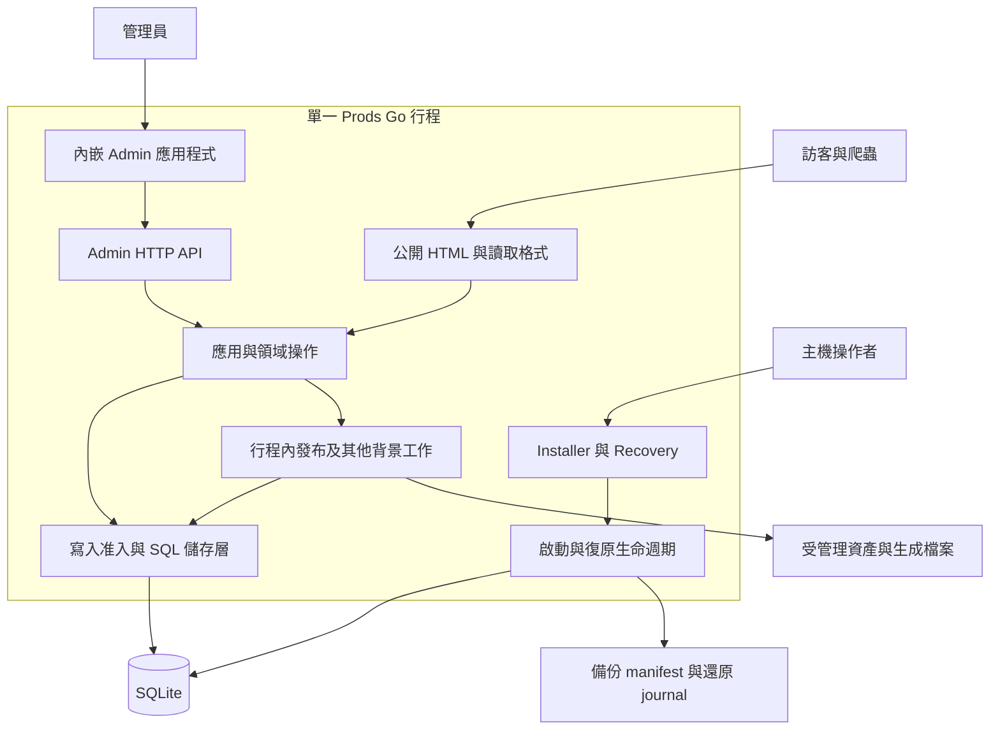

# 架構概覽

[English](../en/architecture.md) | 繁體中文 | [简体中文](../zh-CN/architecture.md)

[README](../../README-zh_TW.md) · [工程案例研究](engineering-case-study.md) · [維運](operations.md)

本文件根據 2026-09-17 檢視的工作目錄原始碼撰寫，當時 `VERSION` 為 `v0.6.8`。內容描述實作，不代表已驗證某個發布成品或正式部署。這組三語工程指南以英文為語意基準，不取代產品需求或歷史決策。

## 系統情境

Prods 提供企業技術型錄與 RFQ（詢價請求）流程。管理員維護產品資料、分類專屬規格、文件及網站設定；訪客探索已發布產品並提交詢價，型錄找不到時也可提出 Requested Part。RFQ 記錄需求，不代表價格、庫存、電氣相容性或銷售訂單。

執行環境採模組化單體：一個 Go 行程、一份 SQLite 資料庫及受管理的檔案系統目錄。背景工作在同一行程執行。部署時可在前方放置 TLS 反向代理；儲存庫並未證實任何特定正式代理正在運作。

圖中分組代表責任，不是可獨立部署的服務。入口與組裝位於 [`cmd/prods/main.go`](../../cmd/prods/main.go) 及 [`internal/webapp/server.go`](../../internal/webapp/server.go)。

## 元件及邊界理由

| 邊界 | 目前實作 | 存在理由 |
| --- | --- | --- |
| 領域與持久化 | `internal/catalog`、`inquiries`、`site`、`localization`；SQL repository 位於 `internal/storage/sqlite` | 規則、持久狀態與交易留在 Go，不依賴瀏覽器框架。 |
| 公開網站 | Go template、生成的產品表示，以及動態搜尋／列表／RFQ handler | 核心內容與基本導覽不需要 JavaScript。 |
| 公開互動增強 | RFQ 選取與列表控制的 React root | 在既有 HTML 上增加互動，不要求整頁 hydration。 |
| Admin | React、headless Refine Core、React Router、TanStack Query、原生 Ant Design v6 | 管理介面可使用應用狀態與表單，不把 Admin 相依套件帶入 Public。 |
| System UI | 獨立 Installer／Recovery 入口與內嵌 system assets | 資料庫損壞或正常 Admin 無法使用時，復原不能依賴同一資料庫／session。 |
| 背景工作 | 行程內的發布、匯入、備份、郵件與搜尋通知管理器 | 以持久紀錄追蹤工作；記憶體中的喚醒訊號不代表完成。 |

參見 [`web/ui/package.json`](../../web/ui/package.json)、分離的 [`Vite 設定`](../../web/ui/vite.public.config.ts)、[`Public roots`](../../web/ui/src/public/main.tsx) 及 [`system 入口`](../../web/ui/src/system/main.tsx)。Public HTML 由 Go 生成，並非 React server-side rendering。Admin 使用 `@refinedev/core`，未使用 `@refinedev/antd`。

## 請求與資料流程

Public operational routes 包含 `GET /api/locales`、`POST /api/rfqs` 及 HTML `GET/POST /rfq`，與生成的讀取格式、需認證的 `/admin/api/` 操作分開。這些路由不代表承諾提供具版本的外部 write-token API。

**型錄編輯與發布。** Admin 請求帶入 session、CSRF token 與預期 revision。儲存層檢查寫入，並在同一交易記錄狀態、必要稽核及發布意圖。發布引擎準備各種表示，再啟用產品的公開單元。儲存編輯與啟用公開 revision 是不同事件；準備替代版本時，可繼續提供前一個有效單元。Hide／Archive 更新可見性，使新的存取准入無法使用已撤銷產品；已准入的傳輸可以完成。公開准入先於條件式回應及 Range 處理。共用資產仍可透過其他有效引用提供。

全站設定與路由變更有獨立的 site epoch 啟用邊界。搜尋等彙總檢視可在產品啟用後收斂，但必須檢查可見性。歷史生成目錄不透過通用檔案服務公開。證據：[`catalog_store.go`](../../internal/storage/sqlite/catalog_store.go)、[`publication_store.go`](../../internal/storage/sqlite/publication_store.go)、[`protocol.go`](../../internal/publishing/protocol.go)、[`發布測試`](../../internal/webapp/publication_test.go)。

**公開探索。** 公開回應使用明確的已發布資料模型 [`PublicView`](../../internal/publishing/view.go)，不直接序列化 Admin 紀錄。HTML、JSON-LD、JSON 與 Markdown 共用此模型。搜尋由應用程式處理 Unicode folding，並跳脫作為字面值的 LIKE 萬用字元；身分比對是另一套責任。[`cataloglisting`](../../internal/cataloglisting/listing.go) 依整個列表範圍計算適用欄位，不只看目前頁面。語系解析記錄各欄位的實際來源，並跳過已停用的候選語系。關閉多語編輯只隱藏編輯控制；公開語系變更必須經過 Website 發布。證據：[`product.go`](../../internal/catalog/product.go)、[`resolver.go`](../../internal/localization/resolver.go)、[`Website 多語測試`](../../internal/webapp/website_localization_test.go)。

**RFQ 提交。** 訪客明確提交表單。高熵 idempotency key 識別這次提交，具版本的 canonical payload hash 識別內容。RFQ、項目與可重播收據一起提交交易。相同 key／內容回傳既有收據；內容不同則衝突。搜尋無結果只在訪客主動選擇後才轉成 Requested Part。SMTP 寄送是另一個經授權且記錄結果的操作。證據：[`rfq.go`](../../internal/inquiries/rfq.go)、[`SubmitRFQ`](../../internal/storage/sqlite/store.go)、[`收據查詢`](../../internal/storage/sqlite/rfq_receipt.go)、[`郵件管理器`](../../internal/maildelivery/manager.go)。

## 持久化模型

| 資料 | 表示與約束 |
| --- | --- |
| 產品身分 | 穩定不透明 ID；Current／Archived 紀錄狀態與 Published／Hidden 可見性分開。Manufacturer + Part Number 衝突在受控寫入內檢查，不靠 DB unique constraint。空白製造商與具名製造商不同。 |
| 技術規格 | Spec definition、可重用 Spec Set、分類指派及逐產品原始值；正規化值帶有來源／規格版本與狀態。缺值或無法解析的值不會默默變成零。 |
| 發布 | 持久意圖、啟用紀錄、site epoch 與不可變生成單元。生成輸出是衍生資料，不是型錄真實資料的唯一副本。 |
| Website 與語系 | 工作中／已發布設定、官方 Public Copy 定義／預設值及客戶覆寫；內容來源語系與 Admin UI 語系無關。 |
| 維運 | SQLite 保存 session、工作、RFQ 收據、稽核、備份紀錄與 migration history；檔案系統 journal 另保存還原證據。 |
| 檔案 | 以穩定 ID 引用的不可變資產、私有 secrets／設定、暫存工作與備份分屬受管理目錄。檔案先完成耐久放置，再提交引用。 |

基礎 schema 位於 [`store.go`](../../internal/storage/sqlite/store.go)，後續變更位於 [`migrations.go`](../../internal/storage/sqlite/migrations.go)。[`spec_document_store.go`](../../internal/storage/sqlite/spec_document_store.go)、[`asset_store.go`](../../internal/storage/sqlite/asset_store.go) 與 [`D9 身分測試`](../../internal/storage/sqlite/d9_identity_test.go) 呈現資料契約。

`beginWrite` 使用 channel 與 context cancellation 序列化已准入寫入。這是單行程協調，不是分散式排程器或延遲保證。Atomic Excel Import 在最終全成全敗交易前先驗證，但最終交易仍可能延遲 RFQ 寫入。Product Bulk 則記錄逐產品結果，允許部分成功。參見 [`import_store.go`](../../internal/storage/sqlite/import_store.go) 與 [`product_bulk_store.go`](../../internal/storage/sqlite/product_bulk_store.go)。

## 認證與 Admin API

正常安裝使用具版本的密碼驗證器與持久、不透明的 server-side session。SQLite 儲存 session token 的摘要，不存 bearer 原值。操作由伺服器端 capability 授權；隱藏按鈕不是授權。共用 Admin transport 傳送 same-origin credentials 與 CSRF header，拒絕過期 session 的回應，並把中斷寫入標示為結果未知。不啟用自動 mutation retry 或樂觀成功。

Refine DataProvider 處理支援的 resource 操作；具名 adapter 保留 Hide、Archive、Clone、URL 變更、preview 等領域流程。具名命令不一定有獨立 HTTP verb 或 endpoint：目前 `publish` adapter 使用帶 revision 的 Product PUT。通用 delete 被拒絕，應使用 Archive。證據：[`password.go`](../../internal/identity/password.go)、[`session 測試`](../../internal/storage/sqlite/installation_test.go)、[`api.ts`](../../web/ui/src/admin/api.ts)、[`dataProvider.ts`](../../web/ui/src/admin/dataProvider.ts)、[`catalogCommands.ts`](../../web/ui/src/admin/catalogCommands.ts)、[`AdminProviders.tsx`](../../web/ui/src/admin/AdminProviders.tsx)。

## 執行環境、安裝與復原

預設路徑以執行檔目錄為基準。設定優先序為 CLI → 環境變數 → 單一 `prods.ini` → 預設值。Node.js／pnpm 用於建置內嵌資產，不是應用主機的執行需求。SQLite driver 為 `modernc.org/sqlite`，發布建置停用 CGO。已有選用 Linux systemd 與 Windows service 程式碼；發布腳本也交叉編譯 macOS 成品，但編譯不等於平台驗收。

啟動先分類持久狀態，再進入正常操作。全新資料進入 Installer；未完成安裝以新 claim 繼續。Installer 原子提交 Owner、最低站點設定、系統分類、必要 log 與 Ready marker，然後要求重啟。無法辨識／損壞的資料庫進入 Recovery Required，不能改成重新安裝。Migration 需要備份證據。Restore 先準備各 root 並寫入持久 journal；`prepared` 後只允許同一操作向前完成，逐 root 檢查後再做最終驗證。Maintenance 控制新操作准入，同時保留修復路徑。執行證據與限制見[維運指南](operations.md)。

## 限制與演進觸發條件

以下是重新評估的條件，不是已核准遷移或 roadmap：

- 代表性匯入的實測競爭使 RFQ 延遲不可接受時，重新評估資料庫／寫入排程；目前沒有經驗證的正式流量範圍。
- Profiling 顯示 worker 資源限制無法保護互動操作，或獨立可用性成為明確需求時，重新評估行程邊界。
- 實際型錄／查詢負載超出目前搜尋投影能力時，再評估搜尋；目前不要求外部搜尋服務。
- 受支援的升級破壞固定套件相容性，或 adapter 維護成本超過框架效益時，重新評估 Admin bridge。
- 原生平台或檔案系統測試顯示 locking、rename、sync、recovery 行為不同時，重新評估儲存／部署假設。Instance lock 沒有實作多節點 failover。

目前實作包含機器可讀型錄輸出，不包含 LLM、RAG 服務或電氣替代料推薦引擎。V1 排除電商、CRM、任意 JavaScript／template、通用頁面編輯器與對外發行的寫入 token。[案例研究](engineering-case-study.md) 說明取捨，不把邊界變成未來規模承諾。
